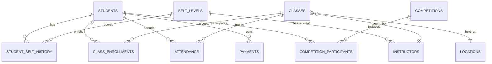

# Akira X Taekwondo - Backend Architecture

## 🏗️ 技术栈

- **数据库**: Cloudflare D1 (SQLite)
- **API**: Cloudflare Workers/Functions  
- **框架**: Next.js 14 (Static Export + API Routes)
- **类型安全**: TypeScript
- **部署**: Cloudflare Pages

## 📁 项目结构

```
akiraxtkd.com/
├── database/                    # 数据库文件
│   ├── schema.sql              # 数据库结构定义
│   └── seed.sql                # 初始化数据
├── functions/                   # Cloudflare Workers API
│   └── api/
│       └── students.ts         # 学员管理API示例
├── types/                      # TypeScript类型定义
│   └── database.ts             # 数据库模型类型
├── lib/                        # API客户端
│   └── api.ts                  # 前端API调用封装
├── hooks/                      # React Hooks
│   └── useStudents.ts          # 学员管理hooks示例
├── docs/                       # 文档
│   └── api-endpoints.md        # API接口文档
├── scripts/                    # 部署脚本
│   └── setup-database.md       # 数据库设置指南
└── wrangler.toml               # Cloudflare配置
```

## 🗄️ 数据库设计

### 核心表结构

1. **students** - 学员基础信息
2. **belt_levels** - 腰带等级系统
3. **student_belt_history** - 学员升级历史
4. **classes** - 课程安排
5. **instructors** - 教练信息
6. **locations** - 训练场地
7. **class_enrollments** - 课程注册关系
8. **attendance** - 出勤记录
9. **payments** - 付费记录
10. **competitions** - 比赛信息
11. **competition_participants** - 比赛参与记录

### 数据关系



## 🚀 快速开始

### 1. 数据库设置

```bash
# 安装Wrangler CLI
npm install -g wrangler

# 登录Cloudflare
wrangler login

# 创建数据库
wrangler d1 create akiraxtkd-db
wrangler d1 create akiraxtkd-db-preview

# 更新wrangler.toml中的database_id

# 初始化数据库
wrangler d1 execute akiraxtkd-db --file=./database/schema.sql
wrangler d1 execute akiraxtkd-db --file=./database/seed.sql
```

### 2. 本地开发

```bash
# 启动开发服务器
npm run dev

# 或使用Cloudflare Pages本地开发
wrangler pages dev --d1=DB:akiraxtkd-db-preview
```

### 3. 部署

```bash
# 构建并部署
npm run build
git push origin master  # 自动触发Cloudflare Pages部署
```

## 📋 API文档

### 基础URL
- **生产**: `https://akiraxtkd.pages.dev/api`
- **预览**: `https://preview.akiraxtkd.pages.dev/api`

### 主要端点

#### 学员管理
```
GET    /api/students              # 获取学员列表
POST   /api/students              # 创建新学员
GET    /api/students/{id}         # 获取学员详情
PUT    /api/students/{id}         # 更新学员信息
DELETE /api/students/{id}         # 删除学员
```

#### 课程管理
```
GET    /api/classes               # 获取课程列表
POST   /api/classes/{id}/enroll   # 学员报名课程
GET    /api/classes/{id}/students # 获取课程学员
```

#### 出勤管理
```
GET    /api/attendance            # 获取出勤记录
POST   /api/attendance            # 记录出勤
```

#### 支付管理
```
GET    /api/payments              # 获取付费记录
POST   /api/payments              # 记录付费
```

### API使用示例

```typescript
// 获取学员列表
const response = await fetch('/api/students?page=1&limit=10&status=Active');
const { data, pagination } = await response.json();

// 创建新学员
const newStudent = await fetch('/api/students', {
  method: 'POST',
  headers: { 'Content-Type': 'application/json' },
  body: JSON.stringify({
    first_name: 'John',
    last_name: 'Doe',
    date_of_birth: '2010-05-15',
    gender: 'Male',
    // ... 其他字段
  })
});
```

## 🔧 前端集成

### API客户端使用

```typescript
import { studentsApi } from './lib/api';

// 使用API客户端
const students = await studentsApi.getStudents({
  page: 1,
  limit: 10,
  status: 'Active'
});
```

### React Hooks使用

```typescript
import { useStudents, useCreateStudent } from './hooks/useStudents';

function StudentsPage() {
  const { students, loading, error, pagination } = useStudents({
    page: 1,
    limit: 10,
    status: 'Active'
  });
  
  const { createStudent, loading: creating } = useCreateStudent();
  
  // 组件逻辑...
}
```

## 🔒 安全特性

### 数据保护
- **加密**: 所有数据在Cloudflare基础设施中加密存储
- **访问控制**: 只有授权的Workers可以访问数据库
- **备份**: Cloudflare自动提供数据备份和恢复

### API安全
- **CORS**: 配置适当的跨域访问策略
- **验证**: 所有输入数据都经过严格验证
- **错误处理**: 统一的错误处理机制
- **日志**: 详细的操作日志记录

## 📊 性能优化

### 数据库优化
- **索引**: 为频繁查询的字段创建索引
- **分页**: 所有列表接口都支持分页
- **预加载**: 相关数据的联合查询

### API优化
- **缓存**: 利用Cloudflare的全球CDN缓存
- **压缩**: 自动gzip压缩API响应
- **并发**: 支持高并发请求处理

## 🎯 扩展性考虑

### 数据模型扩展
- 模块化的表结构设计
- 支持新增字段而不破坏现有功能
- 灵活的关系设计

### API扩展
- RESTful设计支持新端点添加
- 版本控制机制
- 向后兼容性保证

### 功能扩展
- 支付系统集成
- 移动应用API
- 第三方服务集成
- 实时通知系统

## 🚨 监控和维护

### 数据库监控
```bash
# 检查数据库大小
wrangler d1 info akiraxtkd-db

# 查询性能分析
wrangler d1 execute akiraxtkd-db --command="EXPLAIN QUERY PLAN SELECT ..."

# 备份数据库
wrangler d1 export akiraxtkd-db --output=backup.sql
```

### API监控
- Cloudflare Analytics提供详细的API使用统计
- 错误日志通过Cloudflare Dashboard查看
- 性能指标实时监控

## 🔄 开发流程

### 1. 开发新功能
1. 更新数据库schema (如需要)
2. 创建/更新API端点
3. 更新TypeScript类型
4. 添加前端集成代码
5. 编写测试用例

### 2. 部署流程
1. 本地测试
2. 提交代码到Git
3. 自动部署到预览环境
4. 测试验证
5. 合并到主分支
6. 自动部署到生产环境

### 3. 数据库变更
1. 创建migration文件
2. 在预览环境测试
3. 备份生产数据
4. 应用到生产环境

## 📚 相关文档

- [API接口详细文档](./docs/api-endpoints.md)
- [数据库设置指南](./scripts/setup-database.md)
- [Cloudflare D1 官方文档](https://developers.cloudflare.com/d1/)
- [Cloudflare Workers 文档](https://developers.cloudflare.com/workers/)

## 🤝 贡献指南

1. Fork项目仓库
2. 创建功能分支
3. 提交更改
4. 创建Pull Request
5. 代码审查和合并

## 📞 支持

如有问题或建议，请联系：
- 邮箱: teamakiraxtaekwondo@gmail.com
- WhatsApp: +65 8766 8794

---

**Akira X Taekwondo** - 专业跆拳道管理系统 🥋

