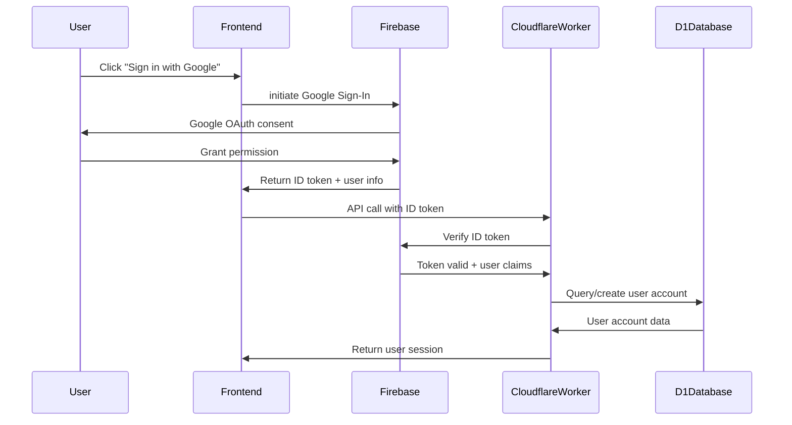

# Akira X Taekwondo 数据库开发指南

## 📋 目录
1. [项目概述与范围](#1-项目概述与范围)
2. [设计原则](#2-设计原则)
3. [角色与访问控制](#3-角色与访问控制)
4. [身份标识与命名规范](#4-身份标识与命名规范)
5. [领域模型](#5-领域模型)
6. [业务规则与约束](#6-业务规则与约束)
7. [并发控制与事务](#7-并发控制与事务)
8. [索引与查询模式](#8-索引与查询模式)
9. [数据导入与初始化](#9-数据导入与初始化)
10. [数据验证与质量控制](#10-数据验证与质量控制)
11. [本地化与国际化](#11-本地化与国际化)
12. [安全性与隐私保护](#12-安全性与隐私保护)
13. [认证与授权](#13-认证与授权)
14. [可观测性与审计](#14-可观测性与审计)
15. [备份与恢复](#15-备份与恢复)
16. [模式版本控制与迁移](#16-模式版本控制与迁移)
17. [测试策略](#17-测试策略)
18. [报告与分析](#18-报告与分析)
19. [扩展性路线图](#19-扩展性路线图)
20. [性能适用性](#20-性能适用性)
21. [术语表](#21-术语表)

---

## 1. 项目概述与范围

本文档定义了Akira X Taekwondo跆拳道学校管理系统的数据库模型、规则和操作实践，涵盖：

- **学员注册与出勤管理**
- **等级与升级考试**
- **比赛管理**
- **账单与支付**
- **文档、公告和审计**
- **基于角色的访问控制** (学员/教练/管理员)
- **未来扩展** (认证、监护人账户、多租户)

### 技术栈
- **数据库**: Cloudflare D1 (SQLite)
- **认证**: Google Sign-In + Firestore
- **API**: Cloudflare Workers/Functions
- **前端**: Next.js 14 + TypeScript
- **部署**: Cloudflare Pages

---

## 2. 设计原则

### 2.1 核心原则
- **清晰胜过巧妙**: 模式反映业务语言 (Class, Session, Enrollment...)
- **稳定标识符**: 所有主键使用时间可排序的UUID (ULID/UUIDv7)
- **不可变历史，可变状态**: 优先使用状态标志和历史记录而非硬删除
- **关注点分离**: 结构化数据存储在D1；大文件存储在R2；短期缓存/标志存储在KV
- **区域安全**: 时间戳以UTC存储；在边缘/应用层以`Asia/Singapore`渲染
- **安全与PDPA**: 数据最小化；私有文件通过签名URL访问；默认审计
- **可演进性**: 保留"链接槽位"以便未来子系统无缝集成

### 2.2 数据完整性
```sql
-- 示例约束
CONSTRAINT unique_enrollment_per_class 
  UNIQUE(student_id, class_id) WHERE status != 'ended'

CONSTRAINT valid_session_date 
  CHECK(session_date >= class_start_date)
```

---

## 3. 角色与访问控制 (RBAC)

### 3.1 角色定义
- **UserAccount**: 登录身份，包含`role ∈ {student, coach, admin}`（当前单角色）
- **StudentProfile / CoachProfile / AdminProfile**: 每个账户对应一个配置文件
- **可见性规则**:
  - *student*: 自己的档案、注册、出勤、升级、比赛报名
  - *coach*: 仅分配给他们的课程/会话/注册
  - *admin*: 全局读写权限；敏感操作（如账单关闭、清除）

### 3.2 权限矩阵

| 资源 | Student | Coach | Admin |
|------|---------|-------|-------|
| 自己的档案 | 读写 | 读 | 读写 |
| 其他学员档案 | 无 | 读（仅分配班级） | 读写 |
| 课程管理 | 读 | 读写（仅分配） | 读写 |
| 出勤记录 | 读（自己） | 读写（分配班级） | 读写 |
| 财务记录 | 读（自己） | 无 | 读写 |
| 系统配置 | 无 | 无 | 读写 |

### 3.3 未来选项
升级为多角色系统（添加`UserRole`表）当一个人扮演多个角色时。

---

## 4. 身份标识与命名规范

### 4.1 主键策略
- **主键**: ULID/UUIDv7字符串
- **显示代码**: 人类可读的显示代码（如`AX-S-000123`）作为独立字段
- **外键**: 始终引用配置文件键（`student_id`, `coach_id`）而非通用用户ID

### 4.2 时间戳规范
- **标准字段**: `created_at`, `updated_at`
- **存储格式**: UTC时间戳
- **业务日期**: 使用专用字段，不与时间戳混用

### 4.3 文本规范化
- **规范形式**: 存储规范化名称形式（小写、无变音符号）在辅助列中用于前缀搜索
- **查找表**: 所有枚举集中在`Lookup`表中避免漂移

---

## 5. 领域模型

### 5.1 人员与账户

#### UserAccount (用户账户)
```sql
CREATE TABLE user_accounts (
    user_id TEXT PRIMARY KEY, -- Firebase UID
    email TEXT UNIQUE NOT NULL,
    google_id TEXT UNIQUE, -- Google OAuth ID
    firebase_uid TEXT UNIQUE NOT NULL, -- Firebase Authentication UID
    
    role TEXT NOT NULL CHECK (role IN ('student', 'coach', 'admin')),
    status TEXT NOT NULL DEFAULT 'active' CHECK (status IN ('active', 'inactive', 'suspended')),
    
    -- Profile information from Google
    display_name TEXT,
    photo_url TEXT,
    email_verified BOOLEAN DEFAULT FALSE,
    
    -- Authentication metadata
    provider TEXT DEFAULT 'google' CHECK (provider IN ('google', 'email')),
    last_login_at DATETIME,
    login_count INTEGER DEFAULT 0,
    
    -- Account management
    terms_accepted_at DATETIME,
    privacy_accepted_at DATETIME,
    
    created_at DATETIME DEFAULT CURRENT_TIMESTAMP,
    updated_at DATETIME DEFAULT CURRENT_TIMESTAMP
);
```

#### StudentProfile (学员档案)
```sql
CREATE TABLE student_profiles (
    student_id TEXT PRIMARY KEY REFERENCES user_accounts(user_id),
    student_code TEXT UNIQUE NOT NULL, -- AXT2024001
    legal_name TEXT NOT NULL,
    display_name TEXT,
    name_normalized TEXT, -- 搜索用
    date_of_birth DATE NOT NULL,
    gender TEXT NOT NULL CHECK (gender IN ('Male', 'Female', 'Other')),
    school_year TEXT,
    medical_notes TEXT,
    
    -- 监护人信息
    primary_guardian_name TEXT,
    primary_guardian_phone TEXT,
    primary_guardian_email TEXT,
    emergency_contacts JSON, -- [{name, phone, relationship}]
    
    -- 训练相关
    target_rank_hint TEXT, -- 教练评估的下一个腰带
    cert_profile_ref TEXT, -- 未来GAL链接
    
    -- 地址信息
    address TEXT,
    postal_code TEXT,
    
    created_at DATETIME DEFAULT CURRENT_TIMESTAMP,
    updated_at DATETIME DEFAULT CURRENT_TIMESTAMP
);
```

#### CoachProfile (教练档案)
```sql
CREATE TABLE coach_profiles (
    coach_id TEXT PRIMARY KEY REFERENCES user_accounts(user_id),
    coach_code TEXT UNIQUE NOT NULL, -- AXT-COACH-001
    legal_name TEXT NOT NULL,
    display_name TEXT,
    phone TEXT,
    email TEXT,
    
    -- 教学相关
    teachable_programs JSON, -- 可教授的项目
    availability_note TEXT,
    in_service_status TEXT DEFAULT 'active',
    cert_profile_ref TEXT, -- 认证链接
    compliance_note TEXT,
    
    -- 资质信息
    current_belt_level_id INTEGER,
    certification_level TEXT,
    years_experience INTEGER,
    specializations JSON,
    hire_date DATE,
    hourly_rate DECIMAL(8,2),
    
    bio TEXT,
    profile_image_url TEXT,
    
    created_at DATETIME DEFAULT CURRENT_TIMESTAMP,
    updated_at DATETIME DEFAULT CURRENT_TIMESTAMP,
    
    FOREIGN KEY (current_belt_level_id) REFERENCES belt_levels(id)
);
```

#### AdminProfile (管理员档案)
```sql
CREATE TABLE admin_profiles (
    admin_id TEXT PRIMARY KEY REFERENCES user_accounts(user_id),
    admin_code TEXT UNIQUE NOT NULL,
    legal_name TEXT NOT NULL,
    display_name TEXT,
    scope_notes TEXT, -- 权限范围说明
    mfa_policy TEXT, -- MFA策略
    
    created_at DATETIME DEFAULT CURRENT_TIMESTAMP,
    updated_at DATETIME DEFAULT CURRENT_TIMESTAMP
);
```

### 5.2 组织与场地

#### Program (项目)
```sql
CREATE TABLE programs (
    program_id TEXT PRIMARY KEY,
    name TEXT NOT NULL,
    description TEXT,
    age_guidance TEXT, -- 年龄指导
    tags JSON, -- 标签数组
    is_active BOOLEAN DEFAULT TRUE,
    
    created_at DATETIME DEFAULT CURRENT_TIMESTAMP,
    updated_at DATETIME DEFAULT CURRENT_TIMESTAMP
);
```

#### Venue (场地)
```sql
CREATE TABLE venues (
    venue_id TEXT PRIMARY KEY,
    name TEXT NOT NULL,
    address TEXT NOT NULL,
    postal_code TEXT,
    capacity INTEGER,
    map_link TEXT,
    facilities JSON, -- 设施列表
    contact_phone TEXT,
    notes TEXT,
    is_active BOOLEAN DEFAULT TRUE,
    
    created_at DATETIME DEFAULT CURRENT_TIMESTAMP,
    updated_at DATETIME DEFAULT CURRENT_TIMESTAMP
);
```

### 5.3 教学与出勤

#### Class (课程)
```sql
CREATE TABLE classes (
    class_id TEXT PRIMARY KEY,
    name TEXT NOT NULL,
    program_id TEXT NOT NULL,
    venue_id TEXT NOT NULL,
    coach_id TEXT NOT NULL,
    
    -- 时间安排
    day_of_week INTEGER NOT NULL CHECK (day_of_week BETWEEN 0 AND 6), -- 0=Sunday
    start_time TIME NOT NULL,
    end_time TIME NOT NULL,
    
    -- 容量管理
    capacity INTEGER DEFAULT 20,
    age_group TEXT,
    skill_level TEXT DEFAULT 'All Levels' CHECK (skill_level IN ('Beginner', 'Intermediate', 'Advanced', 'All Levels')),
    class_type TEXT DEFAULT 'Regular' CHECK (class_type IN ('Regular', 'Competition', 'Private', 'Seminar')),
    
    description TEXT,
    policy_doc_url TEXT,
    status TEXT DEFAULT 'ongoing' CHECK (status IN ('ongoing', 'paused', 'full', 'archived')),
    
    created_at DATETIME DEFAULT CURRENT_TIMESTAMP,
    updated_at DATETIME DEFAULT CURRENT_TIMESTAMP,
    
    FOREIGN KEY (program_id) REFERENCES programs(program_id),
    FOREIGN KEY (venue_id) REFERENCES venues(venue_id),
    FOREIGN KEY (coach_id) REFERENCES coach_profiles(coach_id)
);
```

#### Session (会话)
```sql
CREATE TABLE sessions (
    session_id TEXT PRIMARY KEY,
    class_id TEXT NOT NULL,
    session_date DATE NOT NULL,
    
    -- 计划时间
    planned_start_time TIME NOT NULL,
    planned_end_time TIME NOT NULL,
    
    -- 实际时间
    actual_start_time TIME,
    actual_end_time TIME,
    
    status TEXT DEFAULT 'scheduled' CHECK (status IN ('scheduled', 'cancelled', 'completed')),
    cancellation_reason TEXT,
    notes TEXT,
    
    created_at DATETIME DEFAULT CURRENT_TIMESTAMP,
    updated_at DATETIME DEFAULT CURRENT_TIMESTAMP,
    
    FOREIGN KEY (class_id) REFERENCES classes(class_id),
    UNIQUE(class_id, session_date)
);
```

#### Enrollment (注册)
```sql
CREATE TABLE enrollments (
    enrollment_id TEXT PRIMARY KEY,
    student_id TEXT NOT NULL,
    class_id TEXT NOT NULL,
    
    status TEXT DEFAULT 'active' CHECK (status IN ('active', 'waitlist', 'paused', 'cancelled', 'ended')),
    join_at DATETIME NOT NULL,
    end_at DATETIME,
    first_activated_at DATETIME, -- "加入时间"
    
    -- 等待列表
    waitlist_position INTEGER,
    
    source TEXT, -- 注册来源
    notes TEXT,
    
    created_at DATETIME DEFAULT CURRENT_TIMESTAMP,
    updated_at DATETIME DEFAULT CURRENT_TIMESTAMP,
    
    FOREIGN KEY (student_id) REFERENCES student_profiles(student_id),
    FOREIGN KEY (class_id) REFERENCES classes(class_id),
    
    -- 每个学员每个课程只能有一个非结束的注册
    UNIQUE(student_id, class_id) WHERE status != 'ended'
);
```

#### Attendance (出勤)
```sql
CREATE TABLE attendance (
    attendance_id TEXT PRIMARY KEY,
    session_id TEXT NOT NULL,
    student_id TEXT NOT NULL,
    
    status TEXT NOT NULL CHECK (status IN ('present', 'absent', 'late', 'makeup')),
    taken_by_coach_id TEXT NOT NULL,
    taken_at DATETIME NOT NULL,
    
    arrival_time TIME,
    departure_time TIME,
    notes TEXT,
    
    created_at DATETIME DEFAULT CURRENT_TIMESTAMP,
    
    FOREIGN KEY (session_id) REFERENCES sessions(session_id),
    FOREIGN KEY (student_id) REFERENCES student_profiles(student_id),
    FOREIGN KEY (taken_by_coach_id) REFERENCES coach_profiles(coach_id),
    
    UNIQUE(session_id, student_id)
);
```

### 5.4 等级与升级

#### RankTrack (等级轨道)
```sql
CREATE TABLE rank_tracks (
    track_id TEXT PRIMARY KEY,
    name TEXT NOT NULL, -- Color, Poom, Black
    description TEXT,
    display_order INTEGER NOT NULL,
    
    created_at DATETIME DEFAULT CURRENT_TIMESTAMP
);
```

#### Rank (等级)
```sql
CREATE TABLE ranks (
    rank_id TEXT PRIMARY KEY,
    track_id TEXT NOT NULL,
    name_en TEXT NOT NULL,
    name_zh TEXT,
    color TEXT NOT NULL,
    order_index INTEGER NOT NULL,
    
    is_tip BOOLEAN DEFAULT FALSE,
    is_stripe BOOLEAN DEFAULT FALSE,
    
    -- 资格要求
    min_age INTEGER,
    min_weeks INTEGER,
    min_classes INTEGER,
    
    created_at DATETIME DEFAULT CURRENT_TIMESTAMP,
    
    FOREIGN KEY (track_id) REFERENCES rank_tracks(track_id),
    UNIQUE(track_id, order_index)
);
```

#### StudentRankHistory (学员等级历史)
```sql
CREATE TABLE student_rank_history (
    history_id TEXT PRIMARY KEY,
    student_id TEXT NOT NULL,
    rank_id TEXT NOT NULL,
    
    source TEXT NOT NULL CHECK (source IN ('join', 'external', 'internal_grading')),
    granted_on DATE NOT NULL,
    granted_by TEXT, -- 授予者
    remarks TEXT,
    
    created_at DATETIME DEFAULT CURRENT_TIMESTAMP,
    
    FOREIGN KEY (student_id) REFERENCES student_profiles(student_id),
    FOREIGN KEY (rank_id) REFERENCES ranks(rank_id)
);
```

#### GradingEvent (升级考试)
```sql
CREATE TABLE grading_events (
    event_id TEXT PRIMARY KEY,
    name TEXT NOT NULL,
    event_date DATE NOT NULL,
    venue_id TEXT,
    
    fee DECIMAL(10,2),
    registration_start_date DATE,
    registration_end_date DATE,
    
    eligibility_rules JSON, -- 资格规则快照
    rulebook_url TEXT,
    application_form_url TEXT,
    examiner_cert_snapshot JSON, -- 考官认证快照
    
    status TEXT DEFAULT 'planned' CHECK (status IN ('planned', 'open', 'closed', 'completed')),
    
    created_at DATETIME DEFAULT CURRENT_TIMESTAMP,
    updated_at DATETIME DEFAULT CURRENT_TIMESTAMP,
    
    FOREIGN KEY (venue_id) REFERENCES venues(venue_id)
);
```

#### GradingRegistration (升级报名)
```sql
CREATE TABLE grading_registrations (
    registration_id TEXT PRIMARY KEY,
    event_id TEXT NOT NULL,
    student_id TEXT NOT NULL,
    target_rank_id TEXT NOT NULL,
    
    review_status TEXT DEFAULT 'pending' CHECK (review_status IN ('pending', 'approved', 'rejected')),
    payment_status TEXT DEFAULT 'pending' CHECK (payment_status IN ('pending', 'paid', 'refunded')),
    
    remarks TEXT,
    
    created_at DATETIME DEFAULT CURRENT_TIMESTAMP,
    updated_at DATETIME DEFAULT CURRENT_TIMESTAMP,
    
    FOREIGN KEY (event_id) REFERENCES grading_events(event_id),
    FOREIGN KEY (student_id) REFERENCES student_profiles(student_id),
    FOREIGN KEY (target_rank_id) REFERENCES ranks(rank_id),
    
    UNIQUE(event_id, student_id)
);
```

#### GradingResult (升级结果)
```sql
CREATE TABLE grading_results (
    result_id TEXT PRIMARY KEY,
    registration_id TEXT NOT NULL,
    
    result TEXT NOT NULL CHECK (result IN ('pass', 'fail', 'pending', 'no_show')),
    score DECIMAL(5,2),
    comments TEXT,
    awarded_on DATE,
    
    created_at DATETIME DEFAULT CURRENT_TIMESTAMP,
    
    FOREIGN KEY (registration_id) REFERENCES grading_registrations(registration_id),
    UNIQUE(registration_id)
);
```

### 5.5 比赛管理

#### Competition (比赛)
```sql
CREATE TABLE competitions (
    competition_id TEXT PRIMARY KEY,
    name TEXT NOT NULL,
    host_organization TEXT,
    co_host_organization TEXT,
    sanction_code TEXT,
    level_code TEXT,
    
    start_date DATE NOT NULL,
    end_date DATE NOT NULL,
    main_venue_id TEXT,
    
    disciplines JSON, -- ['Sparring', 'Poomsae', 'Board-break']
    fees JSON, -- {registration: 50, late: 75}
    registration_deadline DATE,
    
    rules_version TEXT,
    contact_info JSON,
    rulebook_url TEXT,
    registration_portal_url TEXT,
    weight_rules_url TEXT,
    
    status TEXT DEFAULT 'planned' CHECK (status IN ('planned', 'open', 'closed', 'ongoing', 'completed')),
    
    created_at DATETIME DEFAULT CURRENT_TIMESTAMP,
    updated_at DATETIME DEFAULT CURRENT_TIMESTAMP,
    
    FOREIGN KEY (main_venue_id) REFERENCES venues(venue_id)
);
```

#### CompDivision (比赛组别)
```sql
CREATE TABLE comp_divisions (
    division_id TEXT PRIMARY KEY,
    competition_id TEXT NOT NULL,
    
    discipline TEXT NOT NULL, -- Sparring, Poomsae, etc.
    gender TEXT NOT NULL CHECK (gender IN ('Male', 'Female', 'Mixed')),
    age_min INTEGER,
    age_max INTEGER,
    weight_min DECIMAL(5,2),
    weight_max DECIMAL(5,2),
    
    allowed_tracks JSON, -- 允许的等级轨道
    rank_min INTEGER,
    rank_max INTEGER,
    
    is_team BOOLEAN DEFAULT FALSE,
    capacity INTEGER,
    
    created_at DATETIME DEFAULT CURRENT_TIMESTAMP,
    
    FOREIGN KEY (competition_id) REFERENCES competitions(competition_id)
);
```

#### CompRegistration (比赛报名)
```sql
CREATE TABLE comp_registrations (
    registration_id TEXT PRIMARY KEY,
    division_id TEXT NOT NULL,
    student_id TEXT,
    team_id TEXT,
    
    club_name TEXT,
    coach_reference TEXT,
    
    payment_status TEXT DEFAULT 'pending' CHECK (payment_status IN ('pending', 'paid', 'refunded')),
    review_status TEXT DEFAULT 'pending' CHECK (review_status IN ('pending', 'approved', 'rejected')),
    
    registered_at DATETIME NOT NULL,
    athlete_cert_snapshot JSON,
    coach_cert_snapshot JSON,
    
    notes TEXT,
    
    created_at DATETIME DEFAULT CURRENT_TIMESTAMP,
    updated_at DATETIME DEFAULT CURRENT_TIMESTAMP,
    
    FOREIGN KEY (division_id) REFERENCES comp_divisions(division_id),
    FOREIGN KEY (student_id) REFERENCES student_profiles(student_id),
    
    UNIQUE(division_id, student_id) WHERE student_id IS NOT NULL,
    CHECK ((student_id IS NOT NULL) OR (team_id IS NOT NULL))
);
```

### 5.6 财务管理

#### Invoice (发票)
```sql
CREATE TABLE invoices (
    invoice_id TEXT PRIMARY KEY,
    invoice_number TEXT UNIQUE NOT NULL,
    student_id TEXT NOT NULL,
    
    status TEXT DEFAULT 'draft' CHECK (status IN ('draft', 'issued', 'paid', 'void', 'refund')),
    currency TEXT DEFAULT 'SGD',
    
    subtotal DECIMAL(10,2) NOT NULL,
    tax_amount DECIMAL(10,2) DEFAULT 0,
    total_amount DECIMAL(10,2) NOT NULL,
    
    issue_date DATE,
    due_date DATE,
    paid_date DATE,
    
    notes TEXT,
    
    created_at DATETIME DEFAULT CURRENT_TIMESTAMP,
    updated_at DATETIME DEFAULT CURRENT_TIMESTAMP,
    
    FOREIGN KEY (student_id) REFERENCES student_profiles(student_id)
);
```

#### FeeItem (费用项目)
```sql
CREATE TABLE fee_items (
    item_id TEXT PRIMARY KEY,
    invoice_id TEXT NOT NULL,
    
    item_type TEXT NOT NULL CHECK (item_type IN ('tuition', 'grading', 'competition', 'equipment', 'other')),
    description TEXT NOT NULL,
    quantity INTEGER DEFAULT 1,
    unit_price DECIMAL(10,2) NOT NULL,
    total_price DECIMAL(10,2) NOT NULL,
    
    -- 关联引用
    class_id TEXT,
    grading_event_id TEXT,
    competition_id TEXT,
    registration_id TEXT,
    
    created_at DATETIME DEFAULT CURRENT_TIMESTAMP,
    
    FOREIGN KEY (invoice_id) REFERENCES invoices(invoice_id),
    FOREIGN KEY (class_id) REFERENCES classes(class_id),
    FOREIGN KEY (grading_event_id) REFERENCES grading_events(event_id),
    FOREIGN KEY (competition_id) REFERENCES competitions(competition_id)
);
```

#### Payment (支付)
```sql
CREATE TABLE payments (
    payment_id TEXT PRIMARY KEY,
    invoice_id TEXT NOT NULL,
    
    amount DECIMAL(10,2) NOT NULL,
    currency TEXT DEFAULT 'SGD',
    payment_method TEXT NOT NULL CHECK (payment_method IN ('cash', 'card', 'bank_transfer', 'paynow', 'online')),
    
    status TEXT DEFAULT 'pending' CHECK (status IN ('pending', 'completed', 'failed', 'cancelled')),
    transaction_ref TEXT,
    idempotency_key TEXT UNIQUE,
    
    payment_date DATETIME,
    processed_by TEXT,
    
    notes TEXT,
    
    created_at DATETIME DEFAULT CURRENT_TIMESTAMP,
    updated_at DATETIME DEFAULT CURRENT_TIMESTAMP,
    
    FOREIGN KEY (invoice_id) REFERENCES invoices(invoice_id)
);
```

### 5.7 文档与公告

#### DocumentTemplate (文档模板)
```sql
CREATE TABLE document_templates (
    template_id TEXT PRIMARY KEY,
    name TEXT NOT NULL,
    version TEXT NOT NULL,
    template_type TEXT NOT NULL CHECK (template_type IN ('waiver', 'media_release', 'medical', 'registration')),
    
    content_url TEXT, -- R2存储的模板文件
    fields_schema JSON, -- 字段定义
    
    is_active BOOLEAN DEFAULT TRUE,
    effective_from DATE,
    effective_to DATE,
    
    created_at DATETIME DEFAULT CURRENT_TIMESTAMP,
    
    UNIQUE(name, version)
);
```

#### DocumentRecord (文档记录)
```sql
CREATE TABLE document_records (
    record_id TEXT PRIMARY KEY,
    template_id TEXT NOT NULL,
    person_id TEXT NOT NULL, -- student_id, coach_id, admin_id
    person_type TEXT NOT NULL CHECK (person_type IN ('student', 'coach', 'admin')),
    
    signed_at DATETIME,
    valid_to DATE,
    
    document_url TEXT, -- R2存储的签名文档
    signature_data JSON, -- 签名相关数据
    
    status TEXT DEFAULT 'pending' CHECK (status IN ('pending', 'signed', 'expired', 'revoked')),
    
    created_at DATETIME DEFAULT CURRENT_TIMESTAMP,
    updated_at DATETIME DEFAULT CURRENT_TIMESTAMP,
    
    FOREIGN KEY (template_id) REFERENCES document_templates(template_id)
);
```

#### Announcement (公告)
```sql
CREATE TABLE announcements (
    announcement_id TEXT PRIMARY KEY,
    title TEXT NOT NULL,
    content TEXT NOT NULL,
    
    audience TEXT NOT NULL CHECK (audience IN ('all', 'students', 'coaches', 'parents', 'by_class', 'by_competition')),
    audience_filter JSON, -- 受众筛选条件
    
    link_url TEXT,
    image_url TEXT,
    
    published_at DATETIME,
    expires_at DATETIME,
    
    created_by_user_id TEXT NOT NULL,
    status TEXT DEFAULT 'draft' CHECK (status IN ('draft', 'published', 'archived')),
    
    created_at DATETIME DEFAULT CURRENT_TIMESTAMP,
    updated_at DATETIME DEFAULT CURRENT_TIMESTAMP,
    
    FOREIGN KEY (created_by_user_id) REFERENCES user_accounts(user_id)
);
```

#### Note (备注)
```sql
CREATE TABLE notes (
    note_id TEXT PRIMARY KEY,
    object_type TEXT NOT NULL CHECK (object_type IN ('student', 'class', 'competition', 'grading_event')),
    object_id TEXT NOT NULL,
    
    content TEXT NOT NULL,
    visibility TEXT DEFAULT 'coach' CHECK (visibility IN ('coach', 'admin')),
    
    author_user_id TEXT NOT NULL,
    
    created_at DATETIME DEFAULT CURRENT_TIMESTAMP,
    updated_at DATETIME DEFAULT CURRENT_TIMESTAMP,
    
    FOREIGN KEY (author_user_id) REFERENCES user_accounts(user_id)
);
```

### 5.8 操作与审计

#### AuditLog (审计日志)
```sql
CREATE TABLE audit_logs (
    log_id TEXT PRIMARY KEY,
    
    object_type TEXT NOT NULL,
    object_id TEXT NOT NULL,
    action TEXT NOT NULL, -- create, update, delete, approve, etc.
    
    actor_user_id TEXT NOT NULL,
    actor_ip TEXT,
    actor_user_agent TEXT,
    
    change_summary JSON, -- 变更摘要
    old_values JSON,
    new_values JSON,
    
    created_at DATETIME DEFAULT CURRENT_TIMESTAMP,
    
    FOREIGN KEY (actor_user_id) REFERENCES user_accounts(user_id)
);
```

#### Lookup (查找表)
```sql
CREATE TABLE lookups (
    lookup_id TEXT PRIMARY KEY,
    category TEXT NOT NULL, -- gender, attendance_status, enrollment_status, etc.
    code TEXT NOT NULL,
    name_en TEXT NOT NULL,
    name_zh TEXT,
    description TEXT,
    display_order INTEGER,
    is_active BOOLEAN DEFAULT TRUE,
    
    created_at DATETIME DEFAULT CURRENT_TIMESTAMP,
    
    UNIQUE(category, code)
);
```

---

## 6. 业务规则与约束

### 6.1 容量与等待列表
- `Class.capacity`限制活跃注册数量；超出部分进入等待列表（按顺序排列）
- 当有席位空出时，按等待列表顺序自动提升

### 6.2 唯一性约束
- **注册**: 每个(student_id, class_id)最多一个非结束状态的注册
- **出勤**: 每个(session_id, student_id)恰好一条记录
- **比赛报名**: 每个(division_id, student_id)最多一条记录

### 6.3 派生值
- **当前等级** = `StudentRankHistory`中最新的通过记录
- **"加入时间"**（每个课程）= `Enrollment.first_activated_at`

### 6.4 软删除策略
- 优先使用终端状态而非删除；保留审计轨迹
- 隐私默认：敏感信息存储在文档(R2)中而非内联；D1中仅存储最小元数据

---

## 7. 并发控制与事务 (D1/SQLite)

### 7.1 写序列化
- D1每个数据库一次执行一个写事务
- 保持事务简短；事务内不执行网络调用

### 7.2 幂等性
- 用户触发的可重复写操作（支付、注册、报名）必须幂等

### 7.3 热点处理
- "课程最后一个席位"或"组别对阵生成" → 在应用层序列化
- 未来：每个课程/组别使用Durable Object强制互斥

### 7.4 缓存一致性
- 如使用KV，缓存30-120秒并在关键更新时失效

---

## 8. 索引与查询模式

### 8.1 高选择性外键索引
```sql
-- 核心外键索引
CREATE INDEX idx_enrollments_student_id ON enrollments(student_id);
CREATE INDEX idx_enrollments_class_id ON enrollments(class_id);
CREATE INDEX idx_attendance_session_id ON attendance(session_id);
CREATE INDEX idx_attendance_student_id ON attendance(student_id);
CREATE INDEX idx_comp_registrations_division_id ON comp_registrations(division_id);
CREATE INDEX idx_comp_registrations_student_id ON comp_registrations(student_id);
```

### 8.2 复合唯一性索引
```sql
-- 复合唯一约束
CREATE UNIQUE INDEX idx_attendance_unique ON attendance(session_id, student_id);
CREATE UNIQUE INDEX idx_comp_reg_unique ON comp_registrations(division_id, student_id) 
  WHERE student_id IS NOT NULL;
```

### 8.3 排序索引
```sql
-- 常用排序字段
CREATE INDEX idx_students_created_at ON student_profiles(created_at);
CREATE INDEX idx_sessions_date ON sessions(session_date);
CREATE INDEX idx_ranks_order ON ranks(track_id, order_index);
```

### 8.4 搜索索引
```sql
-- 搜索优化
CREATE INDEX idx_students_name_norm ON student_profiles(name_normalized);
CREATE INDEX idx_students_code ON student_profiles(student_code);
```

---

## 9. 数据导入与初始化

### 9.1 腰带字典准备
```sql
-- 插入等级轨道
INSERT INTO rank_tracks (track_id, name, display_order) VALUES
('color', 'Color Belts', 1),
('poom', 'Poom Belts', 2),
('black', 'Black Belts', 3);

-- 插入具体等级
INSERT INTO ranks (rank_id, track_id, name_en, color, order_index, is_tip) VALUES
('white', 'color', 'White Belt', 'White', 1, FALSE),
('white_yellow_tip', 'color', 'White Belt with Yellow Tip', 'White', 2, TRUE),
-- ... 更多等级
```

### 9.2 项目和场地种子数据
```sql
-- 插入项目
INSERT INTO programs (program_id, name, description) VALUES
('beginner', 'Beginner Program', 'For new students learning basics'),
('intermediate', 'Intermediate Program', 'For students with some experience'),
('advanced', 'Advanced Program', 'For experienced students');

-- 插入场地
INSERT INTO venues (venue_id, name, address, postal_code) VALUES
('tampines', 'Tampines Training Center', '604 Tampines Avenue 9', '521604'),
('compassvale_a', 'Compassvale Training Center A', '211C Compassvale Lane', '540211');
```

### 9.3 当前数据导入
- 姓名/出生日期/性别 → StudentProfile
- 当前腰带 → StudentRankHistory (source=external)
- "实际/目标腰带" → `target_rank_hint`
- "加入时间" → Enrollment.first_activated_at

### 9.4 会话生成
在滚动时间范围内生成会话（接下来8-12周）

---

## 10. 数据验证与质量控制

### 10.1 姓名处理
- 保留法定姓名和显示姓名
- 存储规范化形式用于索引

### 10.2 日期验证
- 必须是有效的ISO/UTC格式
- 年龄检查在应用层使用本地（新加坡）规则在午夜时比较

### 10.3 资格检查
- 升级/比赛检查从等级历史+出勤统计+配置规则快照中提取
- 不在模式中硬编码逻辑

### 10.4 文档强制
- 对风险活动强制要求免责声明/医疗声明的存在
- 使用应用策略保护

---

## 11. 本地化与国际化

### 11.1 多语言标签
```sql
-- 等级表中的多语言支持
ALTER TABLE ranks ADD COLUMN name_zh TEXT;

-- 或使用翻译表
CREATE TABLE translations (
    translation_id TEXT PRIMARY KEY,
    object_type TEXT NOT NULL,
    object_id TEXT NOT NULL,
    field_name TEXT NOT NULL,
    language_code TEXT NOT NULL,
    translated_text TEXT NOT NULL,
    
    UNIQUE(object_type, object_id, field_name, language_code)
);
```

### 11.2 时区策略
- 存储：UTC时间戳
- 渲染：`Asia/Singapore`时区

### 11.3 数字/货币
- 财务中存储整数分（SGD分）

---

## 12. 安全性与隐私保护

### 12.1 数据最小化
- 仅存储运营和法律义务所需的数据

### 12.2 R2可见性
- **公开**: 海报、规则手册
- **私有**: 身份证件、免责声明、收据
- 仅通过**短期签名URL**访问

### 12.3 访问范围
- 学员看到自己的信息
- 教练看到分配的组
- 管理员看到所有信息

### 12.4 审计优先
- 所有写操作和敏感读操作记录到`AuditLog`

### 12.5 保留策略
- 按对象类别定义（如财务5-7年；伤害报告按规定；常规日志90-180天）

### 12.6 更正/删除权
- 支持数据修复和合法删除，使用编辑加审计安全标记

---

## 13. 认证与授权

### 13.1 认证架构

本系统采用**Google Sign-In + Firebase Authentication + Firestore**的混合认证架构：

- **前端认证**: Google Sign-In SDK
- **身份验证**: Firebase Authentication
- **会话管理**: Firebase ID Tokens
- **用户数据**: Cloudflare D1 (业务数据) + Firestore (认证元数据)

### 13.2 认证流程



### 13.3 Token验证

#### Firebase ID Token验证
```typescript
// Cloudflare Worker中的token验证
import { initializeApp } from 'firebase-admin/app';
import { getAuth } from 'firebase-admin/auth';

async function verifyFirebaseToken(idToken: string) {
  try {
    const decodedToken = await getAuth().verifyIdToken(idToken);
    return {
      uid: decodedToken.uid,
      email: decodedToken.email,
      email_verified: decodedToken.email_verified,
      name: decodedToken.name,
      picture: decodedToken.picture,
      provider: decodedToken.firebase.sign_in_provider
    };
  } catch (error) {
    throw new Error('Invalid token');
  }
}
```

### 13.4 用户账户同步

#### 首次登录用户创建
```typescript
async function createOrUpdateUser(firebaseUser: any, db: D1Database) {
  // Check if user exists in D1
  const existingUser = await db.prepare(
    'SELECT * FROM user_accounts WHERE firebase_uid = ?'
  ).bind(firebaseUser.uid).first();
  
  if (!existingUser) {
    // Create new user account
    await db.prepare(`
      INSERT INTO user_accounts (
        user_id, firebase_uid, email, google_id, display_name, 
        photo_url, email_verified, provider, last_login_at, login_count
      ) VALUES (?, ?, ?, ?, ?, ?, ?, ?, ?, ?)
    `).bind(
      firebaseUser.uid,
      firebaseUser.uid,
      firebaseUser.email,
      firebaseUser.sub, // Google ID
      firebaseUser.name,
      firebaseUser.picture,
      firebaseUser.email_verified,
      firebaseUser.provider,
      new Date().toISOString(),
      1
    ).run();
  } else {
    // Update existing user
    await db.prepare(`
      UPDATE user_accounts 
      SET last_login_at = ?, login_count = login_count + 1,
          display_name = ?, photo_url = ?
      WHERE firebase_uid = ?
    `).bind(
      new Date().toISOString(),
      firebaseUser.name,
      firebaseUser.picture,
      firebaseUser.uid
    ).run();
  }
}
```

### 13.5 角色管理

#### 角色分配策略
```sql
-- 默认新用户为student角色
CREATE TRIGGER set_default_role 
AFTER INSERT ON user_accounts
FOR EACH ROW
WHEN NEW.role IS NULL
BEGIN
  UPDATE user_accounts SET role = 'student' WHERE user_id = NEW.user_id;
END;

-- 角色升级需要管理员权限
CREATE TABLE role_change_requests (
    request_id TEXT PRIMARY KEY,
    user_id TEXT NOT NULL,
    current_role TEXT NOT NULL,
    requested_role TEXT NOT NULL,
    reason TEXT,
    status TEXT DEFAULT 'pending' CHECK (status IN ('pending', 'approved', 'rejected')),
    requested_by TEXT NOT NULL,
    reviewed_by TEXT,
    created_at DATETIME DEFAULT CURRENT_TIMESTAMP,
    reviewed_at DATETIME,
    
    FOREIGN KEY (user_id) REFERENCES user_accounts(user_id),
    FOREIGN KEY (requested_by) REFERENCES user_accounts(user_id),
    FOREIGN KEY (reviewed_by) REFERENCES user_accounts(user_id)
);
```

### 13.6 权限中间件

#### API权限检查
```typescript
interface AuthContext {
  user: {
    uid: string;
    email: string;
    role: 'student' | 'coach' | 'admin';
  };
}

function requireRole(allowedRoles: string[]) {
  return async (context: AuthContext, next: Function) => {
    if (!allowedRoles.includes(context.user.role)) {
      throw new Error('Insufficient permissions');
    }
    return next();
  };
}

// 使用示例
app.get('/api/admin/users', 
  requireAuth,
  requireRole(['admin']),
  getUsersHandler
);

app.get('/api/coach/classes/:id/attendance',
  requireAuth,
  requireRole(['coach', 'admin']),
  getAttendanceHandler
);
```

### 13.7 会话管理

#### Token刷新策略
- **ID Token**: 1小时有效期
- **Refresh Token**: 自动刷新
- **会话存储**: 前端localStorage + httpOnly cookies

#### 安全配置
```typescript
// Firebase配置
const firebaseConfig = {
  apiKey: process.env.FIREBASE_API_KEY,
  authDomain: process.env.FIREBASE_AUTH_DOMAIN,
  projectId: process.env.FIREBASE_PROJECT_ID,
  // 其他配置...
};

// 安全规则
const securityRules = {
  tokenExpiration: 3600, // 1 hour
  maxLoginAttempts: 5,
  lockoutDuration: 900, // 15 minutes
  requireEmailVerification: true
};
```

### 13.8 Firestore集成

#### 认证元数据存储
```typescript
// Firestore中存储的认证相关数据
interface FirestoreUserDoc {
  uid: string;
  email: string;
  displayName: string;
  photoURL: string;
  emailVerified: boolean;
  createdAt: Timestamp;
  lastLoginAt: Timestamp;
  loginHistory: Array<{
    timestamp: Timestamp;
    ip: string;
    userAgent: string;
  }>;
  preferences: {
    language: string;
    timezone: string;
    notifications: boolean;
  };
}

// 同步到Firestore
async function syncToFirestore(user: any) {
  const userRef = db.collection('users').doc(user.uid);
  await userRef.set({
    email: user.email,
    displayName: user.displayName,
    photoURL: user.photoURL,
    emailVerified: user.emailVerified,
    lastLoginAt: FieldValue.serverTimestamp(),
    loginHistory: FieldValue.arrayUnion({
      timestamp: FieldValue.serverTimestamp(),
      ip: getClientIP(),
      userAgent: getUserAgent()
    })
  }, { merge: true });
}
```

### 13.9 安全最佳实践

#### Token安全
- 使用HTTPS传输所有认证数据
- ID Token仅在Authorization header中传输
- 实施CSRF保护
- 定期轮换API密钥

#### 用户数据保护
- 最小权限原则
- 敏感数据加密存储
- 定期安全审计
- 实施速率限制

### 13.10 错误处理

#### 认证错误类型
```typescript
enum AuthErrorType {
  INVALID_TOKEN = 'INVALID_TOKEN',
  TOKEN_EXPIRED = 'TOKEN_EXPIRED',
  INSUFFICIENT_PERMISSIONS = 'INSUFFICIENT_PERMISSIONS',
  USER_NOT_FOUND = 'USER_NOT_FOUND',
  ACCOUNT_SUSPENDED = 'ACCOUNT_SUSPENDED',
  EMAIL_NOT_VERIFIED = 'EMAIL_NOT_VERIFIED'
}

class AuthError extends Error {
  constructor(
    public type: AuthErrorType,
    public message: string,
    public statusCode: number = 401
  ) {
    super(message);
  }
}
```

---

## 14. 可观测性与审计

### 14.1 审计日志捕获
`AuditLog`捕获：
- **何时**: 时间戳
- **谁**: `actor_user_id`
- **什么**: 对象类型/ID + 操作
- **哪里**: IP/用户代理
- **变更**: 紧凑的差异/摘要

### 14.2 不可变导出
考虑**不可变导出**（每日日志包）到存储以符合合规要求

---

## 15. 备份与恢复

### 15.1 快照
- 定期逻辑导出（模式+数据）适合D1恢复

### 15.2 清理副本
- 用于暂存/测试，剥离PII或替换为虚假数据

### 15.3 演练
- 记录RTO/RPO并每季度演练恢复

---

## 16. 模式版本控制与迁移

### 16.1 单一真实来源
- 版本化迁移文件
- 语义编号+人类变更日志

### 16.2 仅向前
- 尽可能仅向前；如需向下迁移，记录数据丢失

### 16.3 部署前检查
- 在暂存环境对生产模式副本运行迁移
- 在高峰时间强制无长时间运行的DDL

---

## 17. 测试策略

### 17.1 单元测试
- 验证和资格计算器

### 17.2 集成测试
- 注册容量、等待列表提升、出勤唯一性、对阵生成

### 17.3 属性测试
- 随机化时间表/花名册以检测竞争条件

### 17.4 测试夹具
- 课程、组别、腰带阶梯的小型现实数据集

---

## 18. 报告与分析

### 18.1 操作视图（逻辑）
- **课程花名册**（按腰带/年龄分组；等待列表）
- **出勤热图**和缺席连续记录
- **升级资格列表**+原因
- **比赛报名、称重通过率、奖牌表**
- **按产品/渠道收入**

### 18.2 重查询
- 定期预聚合
- 如需要，稍后导出到分析存储

---

## 19. 扩展性路线图

### 19.1 第一阶段：认证
- 引入发行者/类型/人员认证表
- 将快照/链接字段迁移到外键而不破坏API

### 19.2 第二阶段：多角色账户
- 添加`UserRole`并允许组合权限

### 19.3 第三阶段：监护人账户
- 从StudentProfile分离；将监护人联系人提升为一等用户

### 19.4 第四阶段：团队/学校门户
- 扩展`CompTeam`和访问范围

### 19.5 第五阶段：工作流
- 对阵/席位分配的Durable Objects
- 异步作业队列（批量导入、PDF生成）

### 19.6 第六阶段：横向扩展
- 如写热点增长，将该子域移至更强的写后端，同时保持只读数据在D1中

---

## 20. 性能适用性 (SQLite / Cloudflare D1)

### 20.1 良好适配
- 读重、小写事务（出勤打卡、注册）
- 数千到数百万行，具有适当索引

### 20.2 写模型
- 每个数据库一次一个写事务
- 设计API使写操作简短且幂等

### 20.3 热点缓解
- 在应用中序列化争用工作流（或稍后使用Durable Objects）

### 20.4 何时重新考虑
- 同一行上的持续高QPS写（如抢票）
- 或复杂的内联分析连接
- 在这种情况下，分片工作流或将热子域移至Postgres，同时保持其余部分在D1中

---

## 21. 术语表

- **Class**: 重复课程定义（每周）
- **Session**: 课程的特定日期发生
- **Enrollment**: 学员↔课程关系，具有容量/等待列表
- **RankTrack/Rank**: 腰带进阶分类法
- **GradingEvent**: 腰带考试会话
- **Competition/Division/Bracket/Bout**: 事件、类别、时间表和比赛
- **Invoice/Payment**: 账单标题和结算
- **DocumentRecord**: 签名同意/免责记录
- **AuditLog**: 问责制的写/读轨迹

---

## 最终说明

- 您的**三角色账户模型**是骨干：`UserAccount.role = student|coach|admin`，配置文件表在整个域中引用
- 认证保持**延迟**；当前模式已包含**链接/快照槽位**以便稍后添加而不破坏消费者
- 通过上述约束、索引和事务规程，**D1/SQLite非常适合**您当前和近期规模

---

*本文档为Akira X Taekwondo跆拳道学校管理系统的数据库开发提供全面指导，确保系统的可维护性、安全性和可扩展性。*
